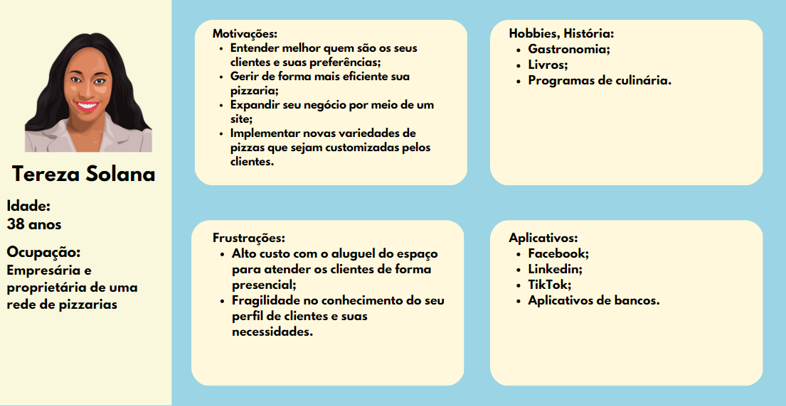
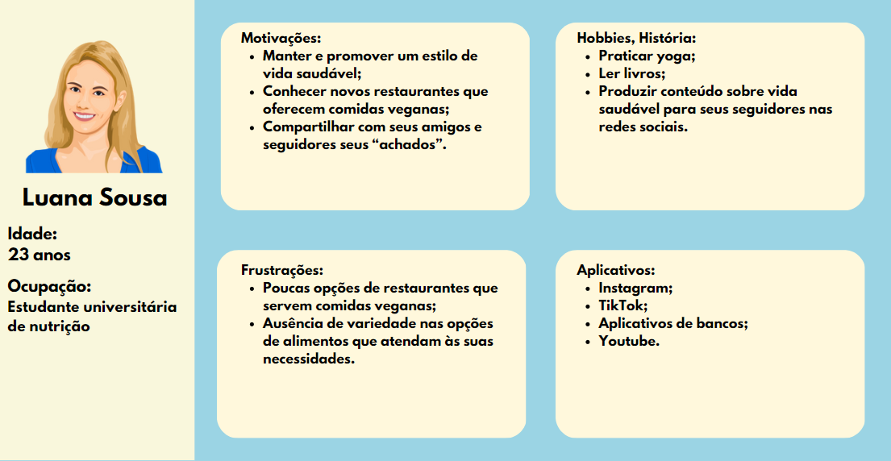
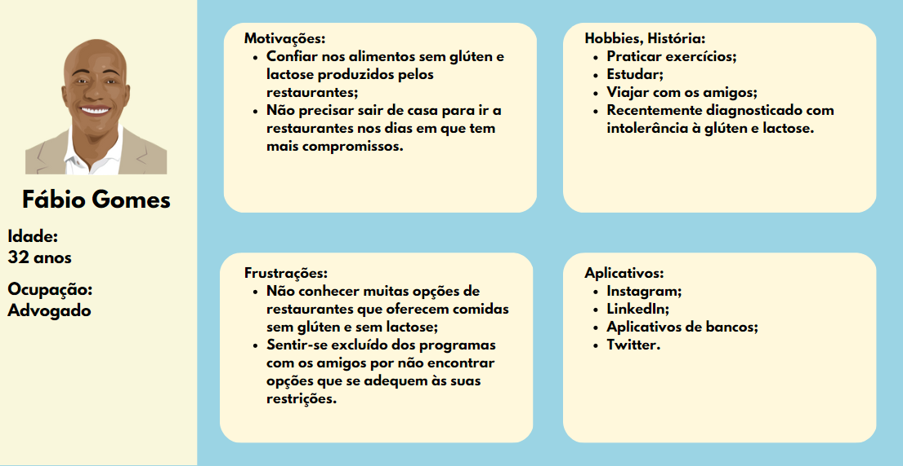
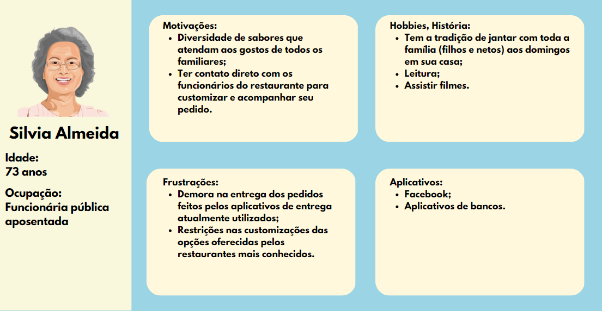

# Especificações do Projeto

## Personas

A persona é o cliente ideal, sendo o arquétipo que reúne todas as características do melhor cliente. Ela é baseada em dados e características de clientes reais, como comportamento, dados demográficos, problemas, desafios e objetivos.  Logo, estamos descrevendo o cliente que muito provavelmente irá procurar esse sistema para realizar o gerenciamento de pedidos em sua pizzaria e seus potenciais clientes. Assim ao definir uma persona o foco deve ser entender o conflito ou problema a fim de determinar como o sistema que será projetado poderá ajudá-lo. 
 As personas levantadas neste projeto englobam as seguintes características: 

## Histórias de Usuários

A partir da compreensão do dia a dia das personas identificadas para o projeto, foram registradas as seguintes histórias de usuários:

|EU COMO...  `PERSONA`| ... QUERO/PRECISO ...  `O QUE`                                                                   |... PARA ...  `POR QUE`            |
|------------------------|-----------------------------------------------------------------------------------------------------|--------------------------------------|
|Luana Sousa             |poder ver as imagens das pizzas prontas antes de escolher                                            |sou capaz de perceber se a apresentação da pizza me agrada.|
|Luana Sousa             |encontrar locais novos que pratiquem a gastronomia inclusiva                                         |porque tenho restrições alimentares e não tenho muitas opções confiáveis.|
|Luana Sousa             |ajudar as pessoas a encontrarem opções saborosas e saudáveis                                         |não existem muitas opções disponíveis e que sejam de conhecimento amplo.|
|Silvia Almeida          |selecionar os ingredientes de acordo com meu gosto pessoal                                           |consigo agradar ao maior número de pessoas que comerão.|
|Silvia Almeida          |entrar em contato facilmente com o estabelecimento                                                   |possa ter um canal direto em caso de necessidade.|
|Silvia Almeida          |encontrar uma pizzaria cujo tempo de entrega não seja tão longo                                      |porque as opções que conheço ficam mais distantes da minha casa e tem um tempo de entrega alargado.|
|Tereza Solana           |ter informações atualizadas sobre meu estoque                                                        |consiga fazer uma melhor gestão e evitar surpresas que impactam no funcionamento.|
|Tereza Solana           |investir na modalidade de delivery                                                                   |atualmente tenho um alto custo para manter o atendimento presencial.| 
|Tereza Solana           |realizar ação social doando pizzas utilizando os ingredientes que possivelmente poderiam ser perdidos|tenho consciência que existem muitas pessoas em condição de fome e que se beneficiariam de tal ação.|
|Fábio Gomes             |ter opções de delivery de estabelecimentos que ofereçam comidas sem glúten e lactose                 |as opções que conheço só tem atendimento presencial e existem dias que é inviável sair de casa.|
|Fábio Gomes             |ter confiança nos alimentos sem glúten e lactose produzidos pelos restaurantes                       |já comi em locais que, apesar de se intitularem inclusivos, na realidade não cuidavam 100% desse aspecto.|
|Fábio Gomes             |apoiar uma causa social de forma constante                                                           |tenho consciência da quantidade de pessoas que necessitam.|
 
## Requisitos

O escopo funcional do projeto é definido por meio dos requisitos funcionais que descrevem as possibilidades interação dos usuários, bem como os requisitos não funcionais que descrevem os aspectos que o sistema deverá apresentar de maneira geral. Estes requisitos são apresentados a seguir.

### Requisitos Funcionais

A tabela a seguir apresenta os requisitos do projeto, identificando a prioridade em que os mesmos devem ser entregues. 
 
|ID    |Descrição do Requisito                                                                                                           |Prioridade|
|------|---------------------------------------------------------------------------------------------------------------------------------|----------|
|RF-001|A aplicação deve apresentar na página principal informações sobre a história da pizzaria.                                        | BAIXA    | 
|RF-002|A aplicação deve apresentar, para cada pizza, uma imagem correspondente. (thumbnail).                                            | ALTA     |
|RF-003|A aplicação deve permitir ao usuário visualizar o cardápio completo da pizzaria com todos os detalhes dos ingredientes.          | ALTA     | 
|RF-004|A aplicação deve permitir ao gestor cadastrar, alterar e remover sabores de pizzas, ingredientes e promoções.                    | ALTA     | 
|RF-005|A aplicação deve permitir que o usuário adicione e remova ingredientes.                                                          | MÉDIA    | 
|RF-006|A aplicação permite que o usuário realize os seus pedidos diretamente por ele.                                                   | ALTA     | 
|RF-007|A aplicação deve oferecer ao gestor uma funcionalidade de relatório de estoque dos produtos da pizzaria.                         | ALTA     | 
|RF-008|A aplicação deve permitir visualizar as informações de contatos do mantenedor do site.                                           | BAIXA    | 
|RF-009|A aplicação deve oferecer ao gestor uma funcionalidade de relatório de vendas.                                                   | ALTA     | 
|RF-010|A aplicação deve permitir que qualquer usuário possa se cadastrar no site.                                                       | BAIXA    | 
|RF-011|A aplicação deve permitir que os usuários tenham acesso aos dados do próprio cadastro para editar ou excluir.                    | BAIXA    | 
|RF-012|A aplicação deve permitir o cadastro e atualização dos produtos de estoque pelos funcionários.                                   | MÉDIA    | 
|RF-013|A aplicação deve possuir uma área de contato, onde qualquer usuário pode enviar um formulário de contato para o e-mail do gestor.| BAIXA    | 
 
### Requisitos não Funcionais
 
A tabela a seguir apresenta os requisitos não funcionais que o projeto deverá atender:

|ID     | Descrição do Requisito                                                                                                          |Prioridade |
|------ |---------------------------------------------------------------------------------------------------------------------------------|-----------|
|RNF-001|A aplicação deve ser publicada em um ambiente acessível publicamente na Internet (Repl.it, GitHub Pages, Heroku);                | ALTA      |
|RNF-002|A aplicação deverá ser responsiva permitindo a visualização em diferentes telas de forma adequada.                               | ALTA      |
|RNF-003|A aplicação deve ter bom nível de contraste entre os elementos da tela em conformidade.                                          | MÉDIA     | 
|RNF-004|A aplicação deve possibilitar que o administrador e usuário façam pesquisa.                                                      | ALTA      |
|RNF-005|A aplicação não permite o recebimento de cadastros de usuários com dados necessários em branco.                                  | BAIXA     |
|RNF-006|A aplicação deverá informar o erro de cadastro e login para o usuário caso os dados inseridos não estejam no banco de dados.     | BAIXA     |
|RNF-007|A aplicação deverá realizar backup dos dados principais de cadastros dos clientes para um banco de dados em nuvem.               | ALTA      |
|RNF-008|A aplicação será desenvolvida através das linguagens C#, .NET e do banco de dados SQL.                                           | ALTA      |
 

## Restrições

As questões que limitam a execução desse projeto e que se configuram como obrigações claras para o desenvolvimento do projeto em questão são apresentadas na tabela a seguir:

|ID   | Restrição                                                                                                                                      |
|-----|------------------------------------------------------------------------------------------------------------------------------------------------|
|RE-01|O projeto deverá ser entregue no final do semestre letivo, não podendo extrapolar a data de 25/06/2023.                                         |
|RE-02|A aplicação interativa deve se restringir às linguagens C#, .NET e ao banco de dados SQL, e deve ser desenvolvida através do Visual Studio Code.|
|RE-03|A equipe não pode subcontratar o desenvolvimento do trabalho.                                                                                   |
|RE-04|A aplicação interativa não deve demandar pagamento.                                                                                             | 

## Diagrama de Casos de Uso

O diagrama de casos de uso a seguir resume as interações dos atores com a aplicação:

 

