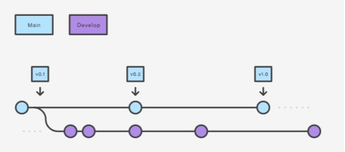
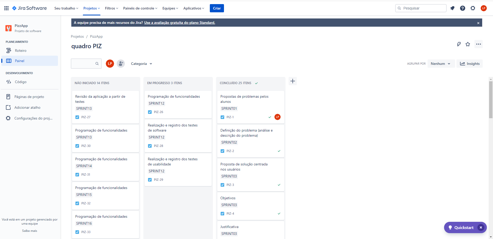

# Metodologia

Nesta seção estão contempladas as definições de ferramentas utilizadas pela equipe tanto para a manutenção dos códigos e demais artefatos quanto para a organização do time na execução das tarefas do projeto.

## Relação de ambientes de trabalho

Os artefatos do projeto são desenvolvidos a partir de diversas plataformas e a relação dos ambientes com seu respectivo propósito é apresentada na tabela que se segue.

|Ambiente                       |Plataforma  |Link de acesso                                                                                                          |
|---------------------------    |----------  |------------------------------------------------------------------------------------------------------------------------|
|Repositório de código-fonte    |GitHub      |[GitHub](https://github.com/ICEI-PUC-Minas-PMV-ADS/pmv-ads-2023-1-e2-proj-int-t1-pmv-ads-2023-1-e2-proj-int-t1-time4-piz)|
|Documentos do projeto          |Google Drive|[Google Drive](https://drive.google.com/drive/folders/1gkqxWfH_FOJLNICULd0HZezAo8I27Q0V)                                | 
|Gerenciamento do projeto       |Trello      |[Jira](https://gerenciamentosite2.atlassian.net/jira/software/projects/PIZ/boards/1)                                  |
|Gerenciamento de diagramas     |Lucid Chart |[Lucid Chart](https://lucid.app/documents#/documents?folder_id=home)                                                    | 
|Gerenciamento de wireframes    |Invision App|[Invision App](https://leticiapauli122925.invisionapp.com/freehand/Pizzaria-FA7MzIBsS?dsid_h=41969b54c828608f7684c65cef03e77d299c8832806237d622ae42691177a05d&uid_h=1ce0f13d3f74fcce104656ea47427273bf16868b29d844bcfcc86b3306964cc7)                       | 
|Gerenciamento do banco de dados|SQL Server Management Studio 2019| [Azure + SQL](https://portal.azure.com/?Microsoft_Azure_Education_correlationId=2a9895954fa64498b5f3ff514ce26ff7&Microsoft_Azure_Education_newA4E=true&Microsoft_Azure_Education_asoSubGuid=3fc9e194-478d-4319-b817-deb62b7f0f16#@leticialayanesgapucminas.onmicrosoft.com/resource/subscriptions/f22ee03b-3a73-483b-9700-b9360ba2ea54/resourceGroups/grupo-puc/providers/Microsoft.Compute/virtualMachines/db01/overview)                                                                                                        |
|Gerenciamento de código-fonte|Visual Studio 2019|                                                                                                                    |
|Serviço de hospedagem da aplicação|Microsoft Azure|[Azure](https://pizzapp20230505203628.azurewebsites.net/)                                                         |
 
 
## Gestão de código-fonte

Para a gestão do código fonte da aplicação interativa desenvolvida pela equipe, o grupo utiliza um processo baseado no Git Flow abordado por Vietro (2015), conforme figura a seguir. Desta forma, todas as manutenções no código são realizadas em branch separado, identificado como Develop.

Fonte da imagem: [atlassian.com](https://www.atlassian.com/br/git/tutorials/comparing-workflows/gitflow-workflow) 

## Gerenciamento do projeto
 
No tocante à dinâmica de organização da equipe, é preconizada a realização de duas reuniões por semana entre os membros da equipe, e uma reunião por semana com a professora orientadora para apresentação  das entregas, com avaliação e possíveis indicações de ajustes a serem executados, além das orientações para as entregas da semana seguinte. As reuniões são organizadas na seguinte forma:
1. Reunião semanal com a Professora orientadora, sempre às terças-feiras às 21:30 na plataforma Teams e gravadas sempre que necessário.
2. Reunião entre os membros da equipe, ordinariamente às quartas-feiras às 16:00 na plataforma Teams. Nesta reunião são discutidos os possíveis ajustes apontados pela Professora na reunião 1, bem como a divisão de tarefas para a próxima entrega.
3. Reunião entre os membros da equipe, ordinariamente às segundas-feiras às 16:00 na plataforma Teams. Nesta reunião são apresentadas as produções definidas na reunião 2 e feitos os ajustes necessários para a entrega da semana. 

Quanto ao gerenciamento do projeto, foram criados quadros Kanban na ferramenta Trello referentes a cada sprint semanal, transformando o trabalho em andamento visível para toda a equipe, criando um sinal visual que indica que a nova atividade pode ou não ser iniciada e se o prazo acordado está sendo seguido. 
Para organização e distribuição das atividades do projeto, o Trello foi estruturado com as seguintes listas:
- Backlog: atividades a serem trabalhadas;
- To Do: atividades da sprint atual;
- Doing: atividades iniciadas e que ainda sem conclusão;
- Done: atividades executadas e prontas para entrega.
 

