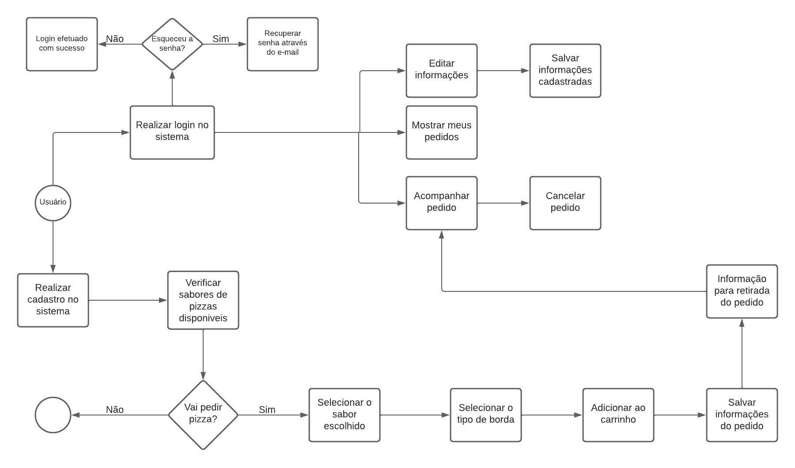
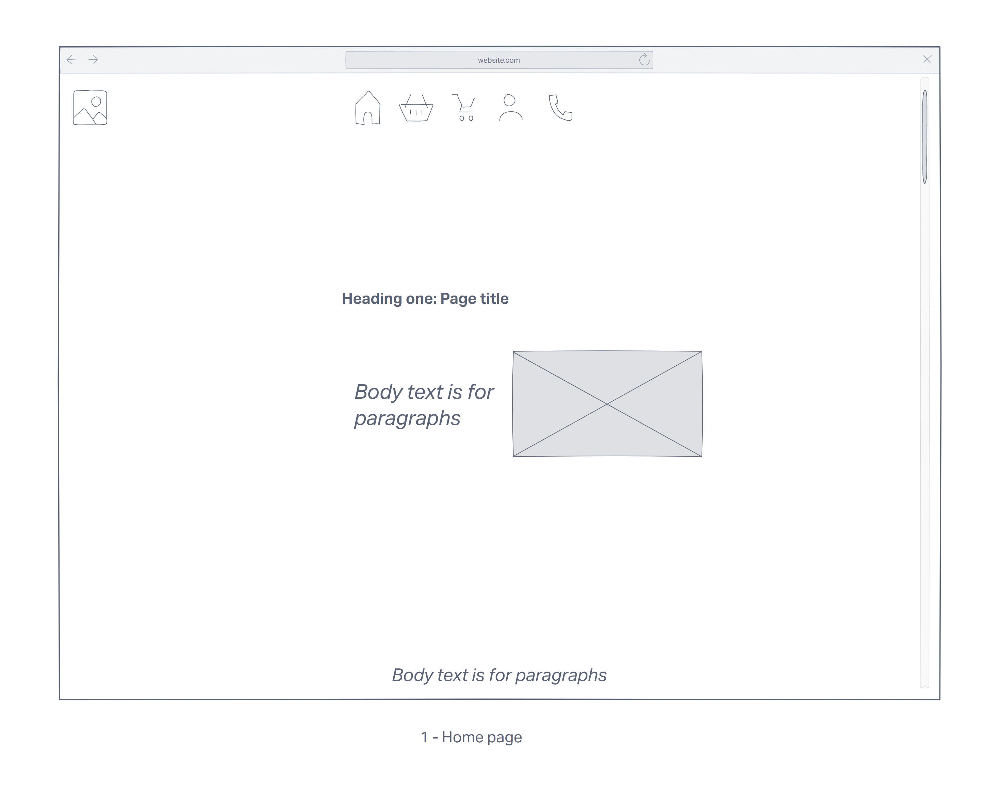
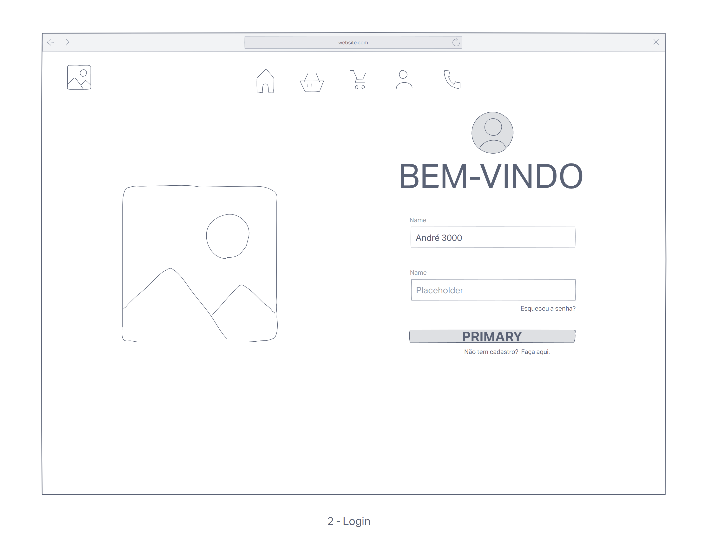
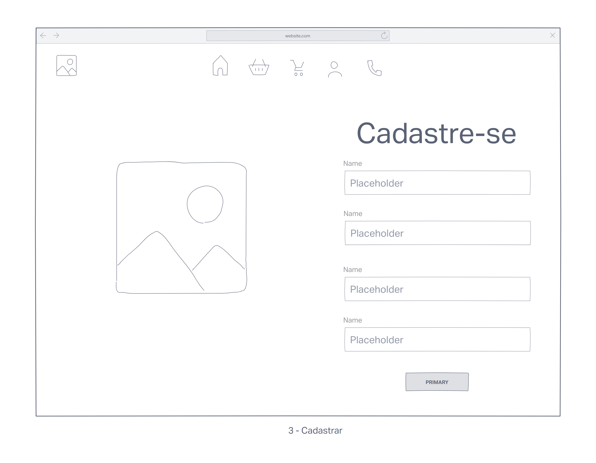
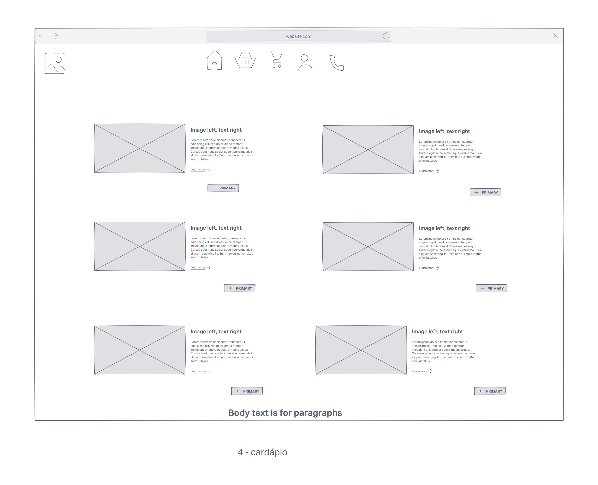
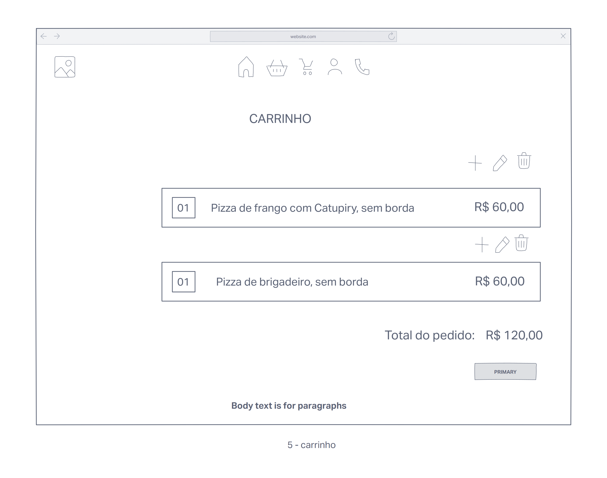
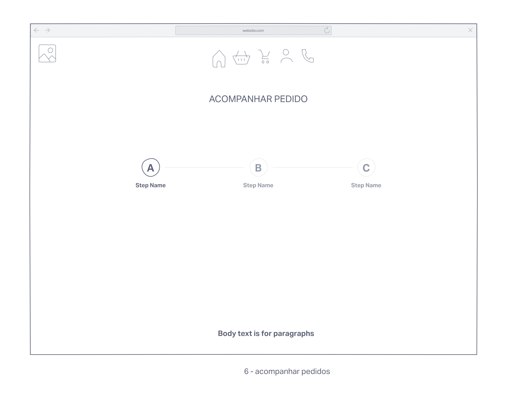
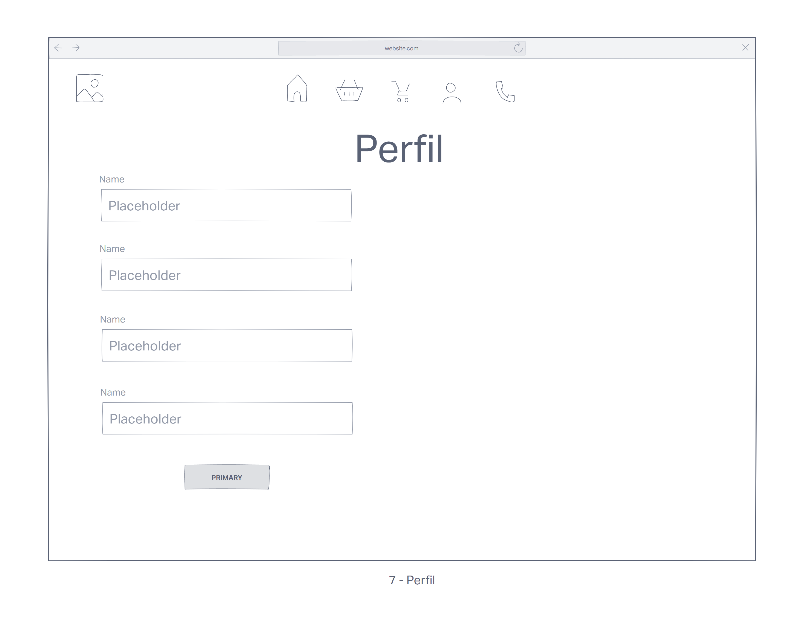
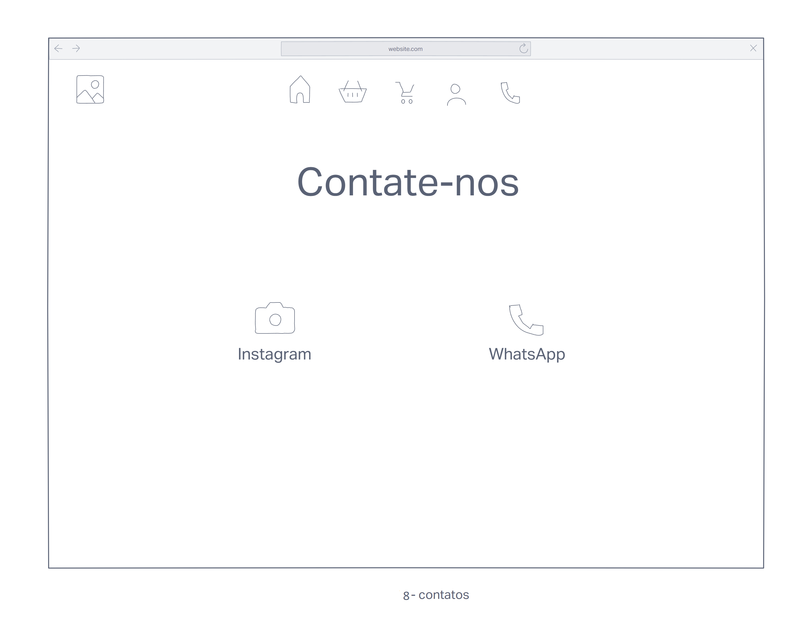

# Projeto de Interface

## Diagrama de Fluxo

O diagrama de fluxo a seguir apresenta a interação do usuário com o sistema interativo da aplicação. O diagrama de fluxo foi desenvolvido com “boxes” que possuem internamente a indicação dos principais elementos de interface.

## Wireframes

A seguir os wireframes concebidos para representar a versão bastante primitiva do visual da aplicação.

A Homepage trará o menu na parte superior (disponível em todas as páginas) com links para a Homepage, cardápio, carrinho, perfil e contato, uma frase de efeito associada à experiência de comer uma saborosa pizza, uma imagem e um botão de login/cadastro.
 
     

A página de login trará uma imagem e dois campos de formulário para login e senha. Terá também opções para recuperação de senha e cadastro para novos usuários.
 
        

A página de cadastro terá uma imagem e campos de formulário para receber do usuário dados de: Nome, Telefone, Login e Senha, e um botão para efetivar o cadastro.
 
        

Após login, o usuário será direcionado para a tela de cardápio onde o usuário poderá acrescentar ao carrinho todos os produtos que quiser.
 
     

Após a seleção dos produtos, o usuário será direcionado para a tela do carrinho, onde os mesmos serão apresentados juntamente com a opção de personalização das pizzas (acréscimos e retiradas de ingredientes).
 
     

Após a confirmação do pedido, o usuário será direcionado para a página de acompanhamento do pedido, onde terão três status: Pedido recebido, Seu pedido está sendo feito, Pedido disponível para retirada.
 
     

Disponível através do menu superior, estará a página de perfil, onde o usuário poderá consultar, editar e atualizar seus dados fornecidos no cadastro.
 
     

Disponível através do menu superior, estará a página de contato, onde estarão disponíveis as redes sociais da pizzaria e contato de WhatsApp.
 
     

Disponível através do menu, estará a página de estoque, onde estarão disponíveis o estoque de ingredientes e produtos da pizzaria.
 
     

Disponível através do menu, estará a página de atendimento, onde estarão disponíveis os pedidos em atendimento da pizzaria.
 
     

Disponível através do menu, estará a página de gerenciamento, onde estarão disponíveis os relatórios e controle de funcionários da pizzaria.
 
 

