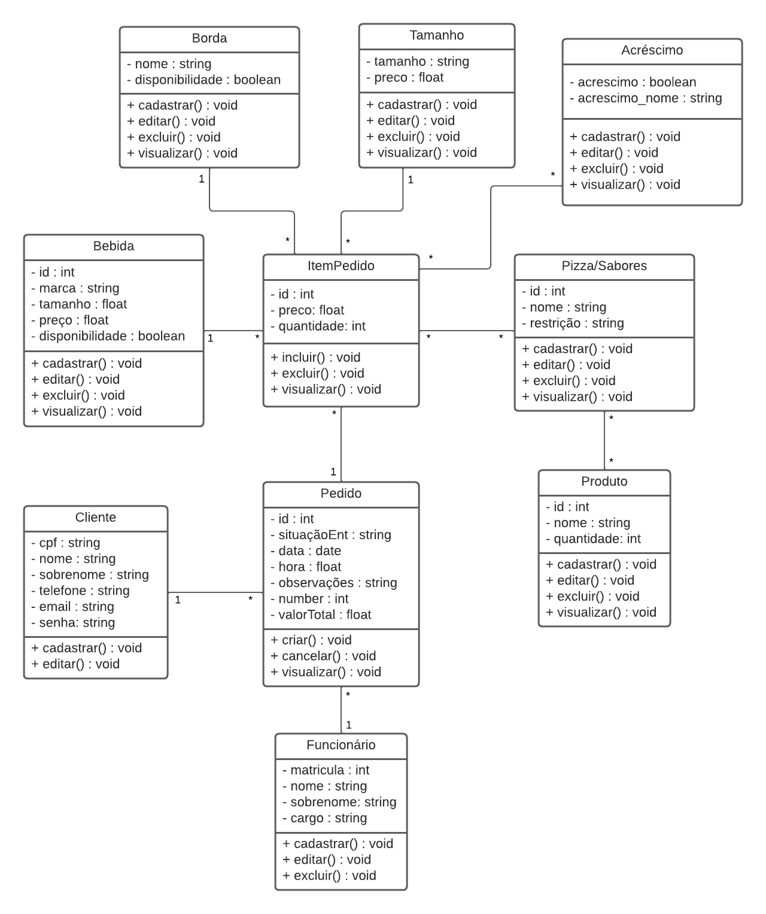

# Arquitetura da Solução

 
O diagrama de classes a seguir ilustra graficamente como será a estrutura do software, e como cada uma das classes da sua estrutura estarão interligadas. Essas classes servem de modelo para materializar os objetos que executarão na memória. Para a execução do diagrama foi utilizada a ferramenta Lucid Chart.
 

 
## Modelo ER (Projeto Conceitual)

O Modelo ER a seguir representa através de um diagrama como as entidades se relacionam entre si na aplicação interativa. Também foi utilizada a ferramenta Lucid Chart.

 

## Projeto da Base de Dados

Tomando como base o Modelo ER acima, foi criado o projeto da base de dados. Utilizando o formato de tabelas, com colunas, chaves primárias (PK) e estrangeiras(FK) foi feita a representação das entidades e relacionamentos. Para o projeto a seguir foi utilizada a ferramenta Lucid Chart.

## Hospedagem

A hospedagem do site e do bancod e dados será realizada na plataforma Azure.
